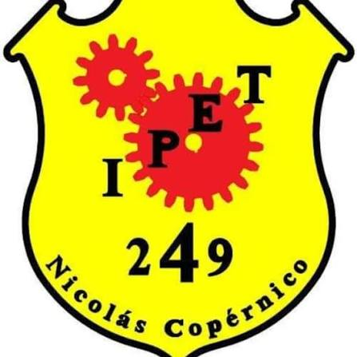

# tp12app
<p align="center">
  
</p>

<h1 align="center">Antonio, la Mascota Virtual de Informática</h1>

<p align="center">
  <b>IPET 249 "Nicolás Copérnico"</b><br>
  Especialidad: Informática<br>
  Asignatura: Laboratorio de Aplicaciones II – 6° G<br>
  Año: 2026
</p>

**Alumno/a:** [Quinteros juan ignacio]

---

## ¿Qué es?

Antonio es un dragón programador que vive en tu computadora. Es una mascota virtual interactiva, al estilo Tamagotchi, hecha con **Python 3 y Pygame**. Hay que cuidarlo: si no le das café, no limpiás sus bugs ni lo dejás programar, sus barras bajan y se pone cansado o triste.

## Manual de uso

### Requisitos

- Python 3.8 o superior
- La librería Pygame

### Cómo ejecutarlo

1. Descargá o cloná el repositorio:
   ```bash
   git clone <URL-de-este-repositorio>
   cd <carpeta-del-repositorio>
   ```
2. Instalá Pygame:
   ```bash
   pip install pygame
   ```
3. Ejecutá el programa:
   ```bash
   python mascota_dragon.py
   ```

> Para que se vea el escudo oficial, tiene que existir el archivo `assets/escudo.png`. Si no está, el programa dibuja un escudo provisorio y funciona igual.

### Controles

| Acción | Tecla | Botón en pantalla | Qué hace |
|---|---|---|---|
| Café de código | `C` | [C] Café de código | Sube la Energía y un poco el Ánimo. Antonio toma café con una animación. |
| Limpiar bugs | `B` | [B] Limpiar bugs | Sube la Salud y elimina los bugs de la pantalla. |
| Programar | `P` | [P] Programar | Antonio programa 3 segundos: sube el Ánimo, pero gasta Energía y algo de Salud. |
| Salir | `ESC` | – | Cierra el programa. |

También se puede jugar haciendo clic con el mouse en los botones.

### Necesidades de Antonio

Las tres barras bajan solas con el tiempo y se ven en el panel de la derecha. Si bajan del 25 %, se ponen rojas.

| Barra | Qué representa | Cómo se recupera |
|---|---|---|
| **Energía** | Carga de batería | Café de código |
| **Ánimo** | Ganas de programar | Programar y café |
| **Salud** | Limpieza de bugs | Limpiar bugs |

Cuando la Salud baja, aparecen **bugs** en pantalla. Si Antonio no puede programar por falta de energía, avisa que necesita café.

### Estados y expresiones

| Estado | Cuándo aparece |
|---|---|
| **Feliz** | Todas las barras están bien. |
| **Cansado** (ojos cerrados y "zzz") | La Energía está por debajo del 25 %. |
| **Triste** | El Ánimo o la Salud están por debajo del 30 %. |
| **Programando** (con laptop) | Mientras ejecuta la acción Programar. |

## Concepto de la mascota

**Por qué un dragón:** el dragón es un personaje fuerte y llamativo que se recuerda fácilmente, y combina muy bien con el mundo tecnológico.

**Identidad institucional:** Antonio es **bordó con detalles amarillos** (alas, cuernos, panza y púas de la cola), los colores del IPET 249. El entorno completo usa la paleta del colegio (bordó, amarillo, rojo y blanco) y el escudo de la escuela está siempre visible en el encabezado.

**Por qué representa a Informática:**

- **Auriculares gamer:** el mundo de los videojuegos y la programación.
- **Lentes de estrella:** el estilo propio del personaje y la creatividad.
- **Chip de circuito en el pecho:** el hardware y la electrónica.
- **Laptop con código:** la programación, que es la base de la especialidad.
- **Café y bugs:** las necesidades de Antonio son parte de la vida real de quien programa.

## Estructura del repositorio

```
├── mascota_dragon.py   # Programa principal
├── assets/
│   └── escudo.png      # Escudo del IPET 249
├── GDD.md              # Documento de diseño del juego
├── IA_LOG.md           # Registro de uso de IA
└── README.md
```

## Documentación

- [GDD.md](GDD.md): diseño completo de las mecánicas, las barras y los estados.
- [IA_LOG.md](IA_LOG.md): tabla de transparencia con las interacciones con IA.
